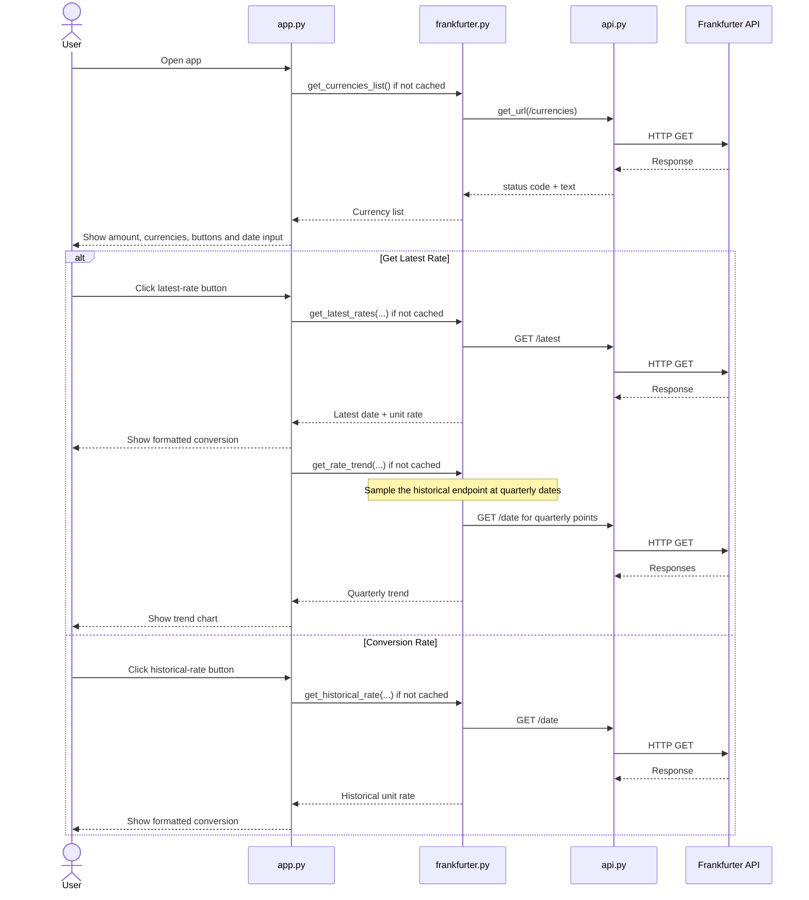

# FX Converter

## Author
**Name:** Ratnadeep Patra  
**Student ID:** 26294153

GitHub Repository: https://github.com/RP28/DSP_AT2_26294153

## Description
FX Converter is a Streamlit web application that uses the Frankfurter API to:

- list the currencies supported by Frankfurter
- retrieve the latest conversion rate between two currencies
- retrieve a historical conversion rate for a selected past date
- calculate the converted amount and inverse conversion rate
- display a three-year rate trend

The required starter function signatures are kept unchanged.

The application deliberately uses only the three Frankfurter endpoint types named in the assignment brief:

1. `/currencies` for the available currency codes
2. `/latest` for the latest exchange rate
3. `/<date>` for historical exchange rates

The three-year trend does not use a separate range/time-series endpoint. Instead, it samples the required historical endpoint at quarterly dates.

### Why `amount` is deliberately not used in the rate requests
The starter signatures for `get_latest_rates()` and `get_historical_rate()` include an `amount` argument, so that parameter is retained for compatibility. However, these functions are designed to return a **unit exchange rate**. The actual amount conversion is performed later in `currency.format_output()` by multiplying the unit rate by the user's amount.

For that reason, both functions contain `del amount`. This does not remove the required parameter from the function signature. It simply makes the intentional non-use of the local variable explicit and prevents the amount from affecting the API request or the rate-cache key. A cached unit rate can therefore be reused for another amount without changing the underlying exchange rate.

### Challenges faced
One challenge was avoiding unnecessary repeated API calls while keeping the solution easy to understand. Caching is handled only in `app.py` using Streamlit's built-in `st.cache_data(max_entries=1)`, so no additional caching library is needed. Each cached function stores only its most recent result. The complete quarterly trend is cached as one result, so repeating the same trend request does not repeat all historical calls.

A second challenge was Streamlit's rerun behaviour. Results are stored in `st.session_state` so they remain visible during normal reruns. Widget callbacks use Streamlit's built-in `st.query_params` API to persist the selected amount, currencies, and historical date across browser refreshes, while clearing any displayed result affected by an input change. This prevents an old conversion from being shown beside newly changed input values.

### Possible future features
Possible extensions include downloadable conversion history, comparison of multiple currency pairs on one chart, and a user-selectable trend period.

## How to Setup
The application was developed with **Python 3.13.5**.

Direct dependencies:

- `streamlit==1.64.0`
- `requests==2.32.5`

Create and activate a virtual environment, then install the dependencies.

### macOS/Linux
```bash
python3 -m venv .venv
source .venv/bin/activate
python3 -m pip install streamlit==1.64.0 requests==2.32.5
```

### Windows PowerShell
```powershell
python -m venv .venv
.venv\Scripts\Activate.ps1
python -m pip install streamlit==1.64.0 requests==2.32.5
```

## How to Run the Program
From the folder containing the five submission files, run:

```bash
streamlit run app.py
```

Then:

1. enter the amount to convert
2. choose the source and destination currencies
3. click **Get Latest Rate** for the latest rate and three-year trend
4. or select a past date and click **Conversion Rate** for a historical rate

The displayed conversion sentence is produced by `currency.format_output()` in the format required by the assignment brief.

## Project Structure

- `app.py` - Streamlit user interface, one-entry Streamlit caches, result display, stale-result protection, and browser-refresh input persistence
- `api.py` - low-level HTTP GET helper with timeout and network-error handling
- `frankfurter.py` - isolated Frankfurter endpoint logic and response validation
- `currency.py` - rounding, inverse-rate calculation, converted-amount calculation, and output formatting
- `README.md` - setup, usage, design notes, functions, sequence diagram, and citations

`frankfurter.py` has no Streamlit dependency. All caching stays in `app.py`, while the Frankfurter API logic can be used or tested independently of the user interface.

## Python Functions

| File | Functions |
| --- | --- |
| `api.py` | `get_url` |
| `currency.py` | `round_rate`, `reverse_rate`, `format_output` |
| `frankfurter.py` | `_load_json`, `_normalise_currency`, `_normalise_date`, `_extract_rate`, `get_currencies_list`, `get_latest_rates`, `_historical_unit_rate`, `get_historical_rate`, `_quarterly_dates`, `get_rate_trend` |
| `app.py` | `_cached_currencies`, `_cached_latest_rate`, `_cached_historical_rate`, `_cached_rate_trend`, `_clear_results`, `_save_inputs`, `_show_result`, `_show_trend` |

## Application Sequence Diagram



## Design and Reliability Notes

- `api.py` uses `requests.get()` directly with a 10-second timeout.
- `frankfurter.py` is independent of Streamlit; it contains only Frankfurter-specific API and validation logic.
- Only the assignment's currency-list, latest-rate, and historical-rate endpoint types are used.
- The three-year chart is built from quarterly calls to the historical endpoint instead of a separate range endpoint.
- API failures, invalid JSON, missing rate fields, invalid currencies, and future historical dates are handled without showing raw exceptions to the user.
- Same-currency conversions return a rate of `1.0` without a redundant rate request.
- `st.cache_data(max_entries=1)` is used in `app.py` for simple one-entry caches, so no separate caching dependency is required.
- Cache wrappers raise before returning when an API call fails, so failure sentinels such as `None`, `(None, None)`, or `{}` are not stored as successful cached results; the next attempt can call the API again.
- The latest-rate cache uses a one-hour TTL so a "latest" rate is refreshed regularly.
- The amount is intentionally excluded from latest/historical rate caching because changing the amount does not change the unit exchange rate.
- Stored Streamlit results are discarded as soon as the inputs on which they depend change, preventing stale results from being displayed.
- Streamlit spinners are shown while loading currencies, fetching the latest rate, fetching/rendering trend data, and fetching a historical rate.
- The amount, selected currencies, and historical date are stored in URL query parameters, allowing the input state to be restored after a browser refresh.
- Streamlit cache data and session state are managed by Streamlit and reset when their corresponding cache/session state is cleared or the application restarts.

## Create the Submission ZIP
The assignment requires the five files to be directly inside the ZIP with no enclosing folder.

### macOS/Linux
```bash
zip dsp_at2_26294153.zip app.py api.py frankfurter.py currency.py README.md
```

### Windows PowerShell
```powershell
Compress-Archive -Path app.py, api.py, frankfurter.py, currency.py, README.md -DestinationPath dsp_at2_26294153.zip -Force
```

## Deployment
Live demo: https://dsp-at2-26294153.onrender.com

Current Render configuration:

- **Service type:** Web Service
- **Runtime:** Python 3
- **Build command:** `pip install streamlit==1.64.0 requests==2.32.5`
- **Start command:** `streamlit run app.py --server.address 0.0.0.0 --server.port $PORT`
- **Environment variable:** `PYTHON_VERSION=3.13.5`

## Citations
No external source code was copied into this submission. The following documentation was consulted while implementing the application:

- Frankfurter API: https://www.frankfurter.app/
- Frankfurter API documentation: https://frankfurter.dev/
- Streamlit documentation: https://docs.streamlit.io/
- Requests documentation: https://requests.readthedocs.io/
- Render documentation: https://render.com/docs/