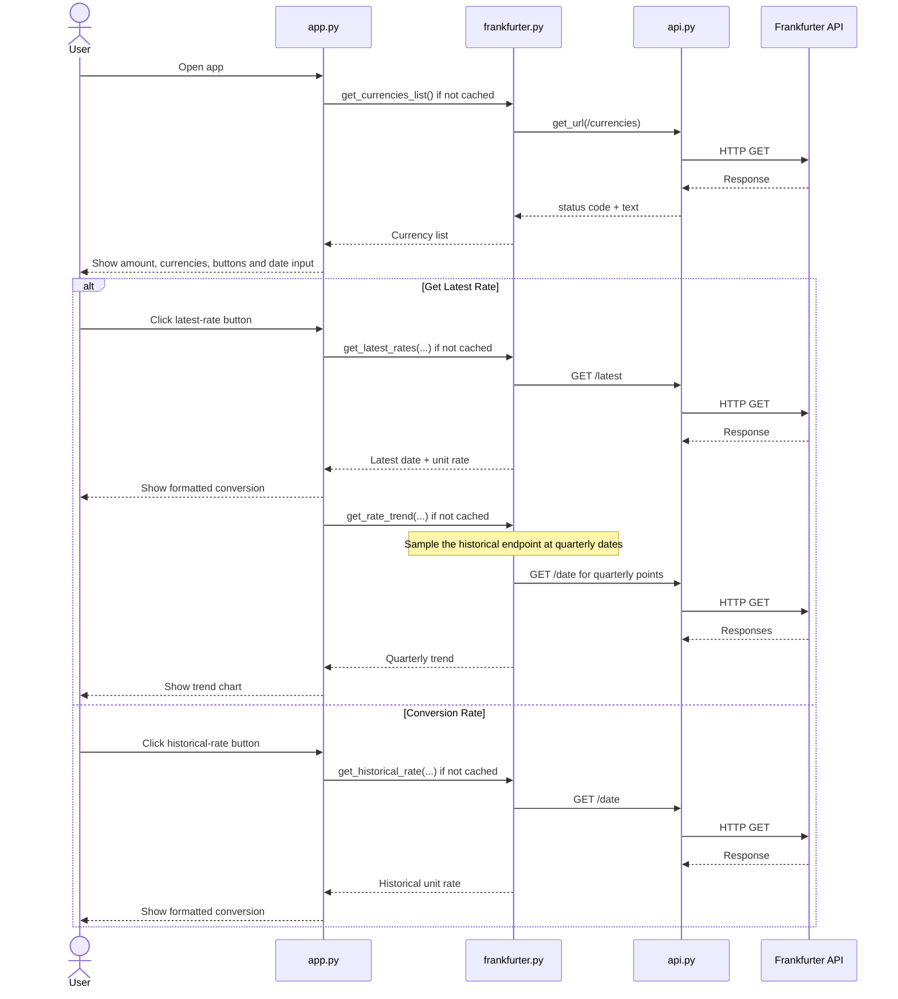

# FX Converter

## Author
**Name:** Ratnadeep Patra  
**Student ID:** 26294153

GitHub Repository: https://github.com/RP28/DSP_AT2_26294153

## Description
FX Converter is a Streamlit web application that uses the Frankfurter API to:

- list the currencies supported by Frankfurter
- retrieve the latest conversion rate between two currencies
- retrieve a historical conversion rate for a selected past date
- calculate the converted amount and inverse conversion rate
- display a three-year rate trend

The application deliberately uses three Frankfurter endpoints:

1. `/currencies` for the available currency codes
2. `/latest` for the latest exchange rate
3. `/<date>` for historical exchange rates

### Why `amount` is deliberately not used in the rate requests

The starter signatures for `get_latest_rates()` and `get_historical_rate()` include an `amount` argument, so the parameter is retained for compatibility. However, these functions are responsible only for retrieving a **unit exchange rate** between two currencies. The actual monetary conversion is handled separately in `currency.format_output()` by multiplying this unit rate by the user's amount.

Keeping the API layer independent of the amount also makes caching more effective. For example, the exchange rate from AUD to USD is the same whether the user converts 10 AUD or 1,000 AUD. By caching the **unit rate** rather than an amount-specific result, the same cached API response can be reused for different conversion amounts without making another request.

For this reason, both functions contain `del amount`. This does not remove or alter the required parameter in the function signature. It simply makes its intentional non-use explicit and ensures that the amount does not affect either the API request or the rate-cache key.

### Challenges faced
One challenge was avoiding unnecessary repeated API calls. Caching is handled only in `app.py` using Streamlit's built-in `st.cache_data()`. The currency list cache stores one result, the latest-rate cache stores up to 10 currency-pair results, the historical-rate cache stores up to five date-and-currency results, and the trend cache stores up to five currency-pair results.

A second challenge was Streamlit's rerun behaviour. Results are stored in `st.session_state` so they remain visible during normal reruns. When a new session starts, `_initialise_state()` restores the selected amount, currencies, and historical date from Streamlit's built-in `st.query_params`. Widget callbacks update those query parameters and clear any displayed result affected by an input change. This prevents an old conversion from being shown beside newly changed input values while still preserving the selected inputs across browser refreshes.

### Possible future features
Possible extensions include downloadable conversion history, comparison of multiple currency pairs on one chart, and a user-selectable trend period.

## How to Setup
The application was developed with **Python 3.13.5**.

Direct dependencies:

- `streamlit==1.64.0`
- `requests==2.32.5`

Create and activate a virtual environment, then install the dependencies.

### macOS/Linux
```bash
python3 -m venv .venv
source .venv/bin/activate
python3 -m pip install streamlit==1.64.0 requests==2.32.5
```

### Windows PowerShell
```powershell
python -m venv .venv
.venv\Scripts\Activate.ps1
python -m pip install streamlit==1.64.0 requests==2.32.5
```

## How to Run the Program
From the folder containing the `app.py`, run:

```bash
streamlit run app.py
```

Then:

1. enter the amount to convert
2. choose the source and destination currencies
3. click **Get Latest Rate** for the latest rate and three-year trend
4. or select a past date and click **Conversion Rate** for a historical rate

## Project Structure

- `app.py` - Streamlit application entry point, user interface, Streamlit caches, input-state restoration, result handling, and browser-refresh persistence
- `api.py` - low-level HTTP GET helper with timeout and network-error handling
- `frankfurter.py` - isolated Frankfurter endpoint logic and response validation
- `currency.py` - rounding, inverse-rate calculation, converted-amount calculation, and output formatting
- `README.md` - setup, usage, design notes, functions, sequence diagram, and citations

`frankfurter.py` has no Streamlit dependency. All caching stays in `app.py`, while the Frankfurter API logic can be used or tested independently of the user interface.

The displayed conversion sentence is produced by `currency.format_output()`.

## Python Functions

| File | Public / Primary Functions | Internal Helper Functions |
| --- | --- | --- |
| `api.py` | `get_url` | — |
| `currency.py` | `round_rate`, `reverse_rate`, `format_output` | — |
| `frankfurter.py` | `get_currencies_list`, `get_latest_rates`, `get_historical_rate`, `get_rate_trend` | `_load_json`, `_normalise_currency`, `_normalise_date`, `_extract_rate`, `_historical_unit_rate`, `_quarterly_dates` |
| `app.py` | `main` | `_initialise_state`, `_cached_currencies`, `_cached_latest_rate`, `_cached_historical_rate`, `_cached_rate_trend`, `_fetch_latest`, `_fetch_historical`, `_clear_results`, `_save_inputs`, `_show_result`, `_show_trend` |

## Application Sequence Diagram



## Design and Reliability Notes

- `api.py` uses `requests.get()` directly with a 10-second timeout.
- `frankfurter.py` is independent of Streamlit and it contains only Frankfurter-specific API and validation logic.
- The three-year chart is built from quarterly calls to the historical endpoint instead of a separate range endpoint.
- API failures, invalid JSON, missing rate fields, invalid currencies, and future historical dates are handled without showing raw exceptions to the user.
- Same-currency conversions return a rate of `1.0` without a redundant rate request.
- Cache wrappers raise before returning when an API call fails, so failure sentinels such as `None`, `(None, None)`, or `{}` are not stored as successful cached results. The next attempt can call the API again.
- The latest-rate cache keeps up to 10 currency-pair results and uses a one-hour TTL so a "latest" rate is refreshed regularly.
- The historical-rate and trend caches each keep up to five successful results.
- The amount is intentionally excluded from latest/historical rate caching because changing the amount does not change the unit exchange rate.
- Stored Streamlit results are discarded as soon as the inputs on which they depend change, preventing stale results from being displayed.
- Streamlit spinners are shown while loading currencies, fetching the latest rate, fetching/rendering trend data, and fetching a historical rate.
- The amount, selected currencies, and historical date are stored in URL query parameters, allowing the input state to be restored after a browser refresh.
- `main()` contains the application flow in the same order as the displayed interface, while supporting API, state, caching, and rendering logic is kept in helper functions.
- Public functions are defined first within each module so the main functionality and intended module interface are immediately visible. Internal helper functions are placed afterwards to keep the implementation details separate from the functions intended to be called directly.
- Functions intended only for internal module use are prefixed with an underscore (`_`), following the standard Python convention for non-public implementation details. Public functions do not use this prefix.
- The 3-year rate trend is grouped with the latest conversion result, while historical conversions are displayed separately for the selected date.

## Compress to ZIP Package
The ZIP package will contain the five main project files directly at the root level.

### macOS/Linux
```bash
zip dsp_at2_26294153.zip app.py api.py frankfurter.py currency.py README.md
```

### Windows PowerShell
```powershell
Compress-Archive -Path app.py, api.py, frankfurter.py, currency.py, README.md -DestinationPath dsp_at2_26294153.zip -Force
```

## Deployment
The application is currently deployed on Render.

Live demo: https://dsp-at2-26294153.onrender.com

Current Render configuration:

- **Service type:** Web Service
- **Runtime:** Python 3
- **Build command:** `pip install streamlit==1.64.0 requests==2.32.5`
- **Start command:** `streamlit run app.py --server.address 0.0.0.0 --server.port $PORT`
- **Environment variable:** `PYTHON_VERSION=3.13.5`

## Citations
No external source code was copied into this submission. The following documentation was consulted while implementing the application:

- Frankfurter API: https://www.frankfurter.app/
- Frankfurter API documentation: https://frankfurter.dev/
- Streamlit documentation: https://docs.streamlit.io/
- Requests documentation: https://requests.readthedocs.io/
- Render documentation: https://render.com/docs/