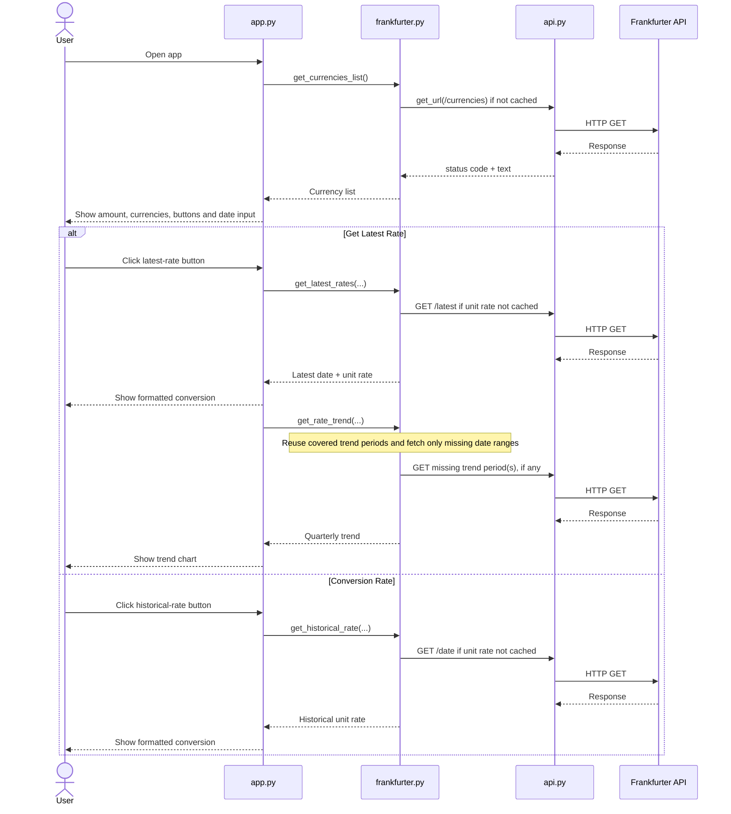

# FX Converter

## Author
**Name:** Ratnadeep Patra  
**Student ID:** 26294153

GitHub Repository: https://github.com/RP28/DSP_AT2_26294153

## Description
FX Converter is a Streamlit web application that uses the Frankfurter API to:

- list the currencies supported by Frankfurter
- retrieve the latest conversion rate between two currencies
- retrieve a historical conversion rate for a selected past date
- calculate the converted amount and inverse conversion rate
- display the optional three-year rate trend provided in the starter template

The required starter function signatures are kept unchanged. Latest and historical API requests cache the **unit rate**, so changing only the amount does not create another request for the same currency pair/date.

### Challenges faced
The main challenge was keeping the app responsive without repeatedly calling the API. Exact latest/historical requests are cached, while the three-year trend uses a small interval cache. If a later trend request overlaps a period already loaded, only the missing date range is requested.

A second challenge was Streamlit's rerun behaviour. `st.session_state` keeps the current result visible during normal widget reruns, and the current input values are also stored in URL query parameters so they can be restored after a browser refresh.

### Possible future features
Possible extensions include downloadable conversion history, comparison of multiple currency pairs on one chart, and a user-selectable trend period.

## How to Setup
The application was developed with **Python 3.13.5**.

Direct dependencies:

- `streamlit==1.64.0`
- `requests==2.32.5`

Create and activate a virtual environment, then install the dependencies.

### macOS/Linux
```bash
python3 -m venv .venv
source .venv/bin/activate
python3 -m pip install streamlit==1.64.0 requests==2.32.5
```

### Windows PowerShell
```powershell
python -m venv .venv
.venv\Scripts\Activate.ps1
python -m pip install streamlit==1.64.0 requests==2.32.5
```

## How to Run the Program
From the folder containing the five submission files, run:

```bash
streamlit run app.py
```

Then:

1. enter the amount to convert
2. choose the source and destination currencies
3. click **Get Latest Rate** for the latest rate and three-year trend
4. or select a past date and click **Conversion Rate** for a historical rate

The displayed conversion sentence is produced by `currency.format_output()` in the format required by the assignment brief.

## Project Structure
The submission contains only the five files required by the assignment:

- `app.py` - Streamlit user interface, spinners, result display, session-state persistence, and browser-refresh input persistence
- `api.py` - low-level HTTP GET helper with timeout and network-error handling
- `frankfurter.py` - Frankfurter endpoint calls, response validation, exact-result caching, and non-repeating trend-period caching
- `currency.py` - rounding, inverse-rate calculation, converted-amount calculation, and output formatting
- `README.md` - setup, usage, design notes, functions, sequence diagram, and citations

## Python Functions

| File | Functions |
| --- | --- |
| `api.py` | `get_url` |
| `currency.py` | `round_rate`, `reverse_rate`, `format_output` |
| `frankfurter.py` | `_load_json`, `_normalise_currency`, `_normalise_date`, `_extract_rate`, `_cached_currencies`, `get_currencies_list`, `_cached_latest_unit_rate`, `get_latest_rates`, `_cached_historical_unit_rate`, `get_historical_rate`, `_trend_cache_entry`, `_merge_ranges`, `_missing_ranges`, `_fetch_trend_window`, `get_rate_trend` |
| `app.py` | `_query_value`, `_saved_amount`, `_saved_currency_index`, `_saved_date`, `_save_inputs`, `_show_result`, `_show_trend` |

## Application Sequence Diagram



## Design and Reliability Notes

- `api.py` uses `requests.get()` directly with a 10-second timeout. This keeps the starter helper simple and easy to test.
- API failures, invalid JSON, missing rate fields, invalid currencies, and future historical dates are handled without showing raw exceptions to the user.
- Same-currency conversions return a rate of `1.0` without a redundant rate request.
- Latest-rate cache entries are kept for one hour and historical rate entries for 30 days.
- The supported-currency list is cached for seven days.
- Trend data is cached in memory for up to 7 days for a maximum of 64 currency pairs. When requested periods overlap, only date ranges not already available in the cache are fetched from Frankfurter.
- Failed API calls are raised internally before a cached helper returns, so failures are not stored as valid cached values.
- Streamlit spinners are shown while loading currencies, fetching the latest rate, fetching/rendering trend data, and fetching a historical rate.
- The amount, selected currencies, and historical date are stored in URL query parameters, allowing the input state to be restored after a browser refresh.
- In-memory caches and `st.session_state` reset when the Streamlit server/session itself is restarted.

## Create the Submission ZIP
The assignment requires the five files to be directly inside the ZIP with no enclosing folder.

### macOS/Linux
```bash
zip dsp_at2_26294153.zip app.py api.py frankfurter.py currency.py README.md
```

### Windows PowerShell
```powershell
Compress-Archive -Path app.py, api.py, frankfurter.py, currency.py, README.md -DestinationPath dsp_at2_26294153.zip -Force
```

## Deployment
Live demo: https://dsp-at2-26294153.onrender.com

Current Render configuration:

- **Service type:** Web Service
- **Runtime:** Python 3
- **Build command:** `pip install streamlit==1.64.0 requests==2.32.5`
- **Start command:** `streamlit run app.py --server.address 0.0.0.0 --server.port $PORT`
- **Environment variable:** `PYTHON_VERSION=3.13.5`

## Citations
No external source code was copied into this submission. The following documentation was consulted while implementing the application:

- Frankfurter API: https://www.frankfurter.app/
- Frankfurter API documentation: https://frankfurter.dev/
- Streamlit documentation: https://docs.streamlit.io/
- Requests documentation: https://requests.readthedocs.io/
- Render documentation: https://render.com/docs/