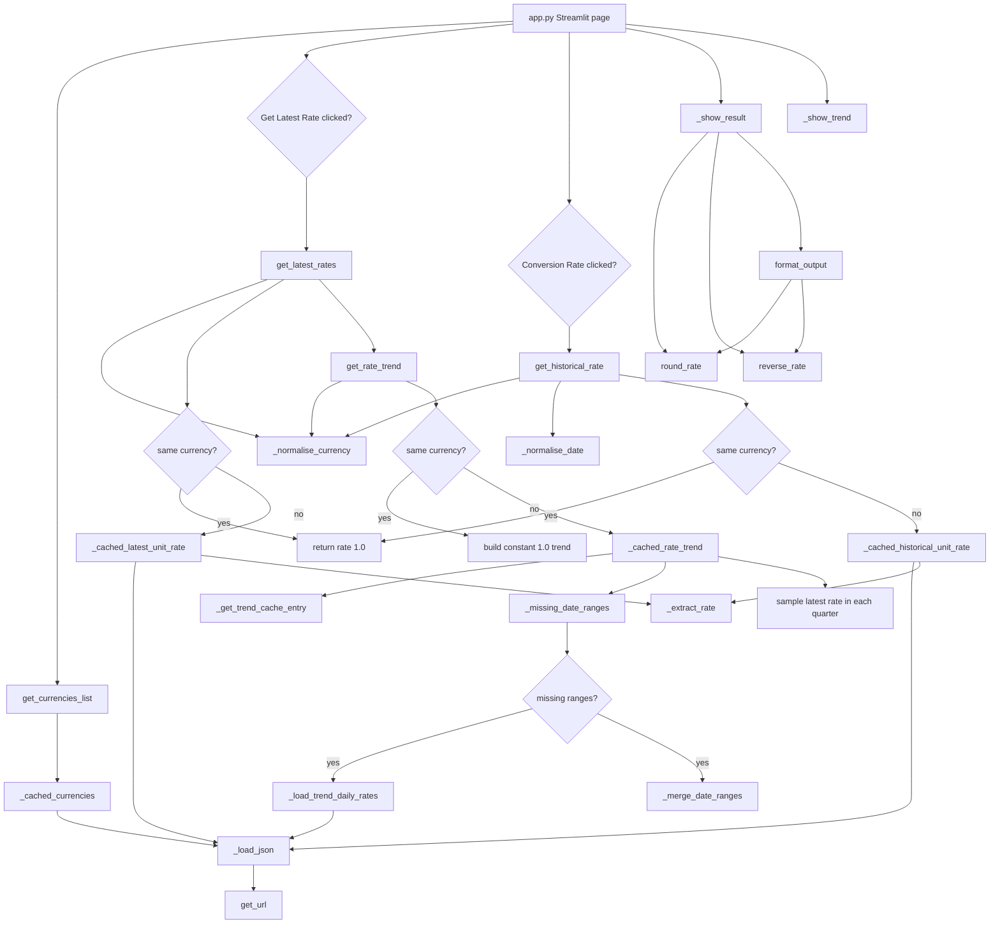

# FX Converter

## Author
Name: `Ratnadeep Patra`  
Student ID: `26294153`

GitHub Repository: https://github.com/RP28/DSP_AT2_26294153

## Description
FX Converter is a Streamlit web application that uses the Frankfurter API to list supported currencies, retrieve the latest exchange rate, retrieve a historical rate for a selected date, calculate the converted amount, and calculate the inverse rate. The starter's optional three-year rate-trend function is also implemented and shown after a successful latest-rate lookup.

The public latest and historical functions still accept `amount`, but the API layer caches the underlying **unit rate** independently of amount and performs `converted_amount = amount * rate` locally. This prevents changing only the amount from creating another downstream request for the same pair/date.

## How to Setup
The application was designed for **Python 3** with these direct dependencies:

- `streamlit==1.64.0`
- `requests==2.32.5`

Create and activate a virtual environment, then install the dependencies:

```bash
python3 -m venv .venv
source .venv/bin/activate          # macOS/Linux
.venv\Scripts\activate         # Windows
python3 -m pip install streamlit==1.64.0 requests==2.32.5
```

## How to Run the Program
From the folder containing the five submission files, run:

```bash
streamlit run app.py
```

Then select an amount and two currencies. Use **Get Latest Rate** for the latest conversion, or select a past date and use **Conversion Rate** for a historical conversion. The displayed sentence follows the format required by the assignment.

## Project Structure
- `app.py` - Streamlit UI, input validation, session-state result persistence, loading/error feedback, metrics, and the optional trend chart.
- `api.py` - low-level HTTP GET helper using a reusable `requests.Session` and a finite 10-second timeout.
- `frankfurter.py` - Frankfurter endpoint integration, response validation, same-currency handling, bounded caching, and trend sampling.
- `currency.py` - rate rounding, inverse-rate calculation, converted-amount calculation, and required output formatting.
- `README.md` - project documentation, setup, engineering decisions, and deployment configuration.

### Python functions

| File | Public functions | Private functions |
| --- | --- | --- |
| `api.py` | `get_url` | - |
| `currency.py` | `round_rate`, `reverse_rate`, `format_output` | - |
| `frankfurter.py` | `get_currencies_list`, `get_latest_rates`, `get_historical_rate`, `get_rate_trend` | `_load_json`, `_normalise_currency`, `_normalise_date`, `_extract_rate`, `_cached_currencies`, `_cached_latest_unit_rate`, `_cached_historical_unit_rate`, `_get_trend_cache_entry`, `_merge_date_ranges`, `_missing_date_ranges`, `_load_trend_daily_rates`, `_cached_rate_trend` |
| `app.py` | - | `_show_result`, `_show_trend` |

## Function Flow and Pseudocode
The application starts in `app.py`. The Streamlit UI collects user inputs, then calls the public functions in `frankfurter.py` for exchange-rate data and the public functions in `currency.py` for display calculations.



### Main UI pseudocode
```text
START app.py
    call get_currencies_list()
        call _cached_currencies()
            call _load_json()
                call get_url()
        return sorted currency codes or None

    if currencies cannot be loaded
        show error and stop app

    show amount input
    show From Currency and To Currency dropdowns
    use AUD and USD as default selected currencies when available

    if user clicks Get Latest Rate
        call get_latest_rates(from_currency, to_currency, amount)
        if latest rate is returned
            save result in st.session_state
            call get_rate_trend(from_currency, to_currency, TREND_YEARS)
            save trend in st.session_state
        else
            show error

    if latest result exists in st.session_state
        call _show_result()
            call round_rate()
            call reverse_rate()
            call format_output()
                call round_rate()
                call reverse_rate()
        call _show_trend()

    show historical date input

    if user clicks Conversion Rate
        call get_historical_rate(from_currency, to_currency, historical_date, amount)
        if historical rate is returned
            save result in st.session_state
        else
            show error

    if historical result exists in st.session_state
        call _show_result()
END
```

### API and cache pseudocode
```text
get_url(url)
    send HTTP GET request through the shared requests.Session
    if request fails or times out
        return status 0 and an error message
    if HTTP status is not successful
        return the HTTP status and a short error message
    return status code and response text

_load_json(url)
    call get_url(url)
    if status is not 200
        raise _FrankfurterError
    parse response text as JSON
    validate that parsed JSON is a dictionary
    return parsed JSON

_normalise_currency(currency)
    trim whitespace
    convert currency code to uppercase
    check that it is three alphabetic characters
    return normalised currency code

_normalise_date(value)
    convert input to ISO date text
    check that the date is valid
    reject future dates
    return normalised date text

_extract_rate(payload, to_currency)
    read the rates dictionary from the API payload
    find the requested destination currency
    check that the rate is a positive number
    return the rate as a float

get_latest_rates(from_currency, to_currency, amount)
    normalise both currency codes with _normalise_currency()
    if both currencies are the same
        return today's date and rate 1.0
    call _cached_latest_unit_rate(from_currency, to_currency)
        call _load_json() for the Frankfurter latest endpoint
        call _extract_rate()
        return latest date and unit rate
    return None values on handled errors

get_historical_rate(from_currency, to_currency, from_date, amount)
    normalise both currency codes with _normalise_currency()
    normalise and validate the date with _normalise_date()
    if both currencies are the same
        return rate 1.0
    call _cached_historical_unit_rate(from_currency, to_currency, date)
        call _load_json() for the Frankfurter date endpoint
        call _extract_rate()
        return unit rate
    return None on handled errors

get_rate_trend(from_currency, to_currency, years)
    validate years
    normalise both currency codes with _normalise_currency()
    calculate start date and end date
    if both currencies are the same
        build a quarterly trend where every rate is 1.0
    otherwise call _cached_rate_trend(from_currency, to_currency, start, end)
    return trend dictionary or empty dictionary on handled errors

_cached_rate_trend(from_currency, to_currency, start_date, end_date)
    call _get_trend_cache_entry()
        return active cache entry for the currency pair
        expire old entries after the trend TTL
        remove the oldest pair when the pair limit is reached

    call _missing_date_ranges()
        compare requested date range with already covered cached ranges
        return only the date ranges not already stored

    for each missing date range
        call _load_trend_daily_rates()
            call _load_json() for only that missing Frankfurter time-series window
            extract valid daily rates
        add the new daily rates to the pair cache
        call _merge_date_ranges()
            combine overlapping or adjacent cached ranges

    read the requested dates from the combined cached daily rates
    sample the latest available rate in each calendar quarter
    return the quarterly trend dictionary
```

### Display helper pseudocode
```text
round_rate(rate)
    round the rate to 4 decimal places
    return rounded rate

reverse_rate(rate)
    if rate is 0
        return 0
    divide 1 by the rate
    call round_rate()
    return rounded inverse rate

format_output(date, from_currency, to_currency, rate, amount)
    call round_rate(rate)
    calculate converted amount as amount * rate
    call reverse_rate(rate)
    build the required output sentence
    return formatted sentence

_show_result(title, result)
    show the result heading
    show unit rate metric using round_rate()
    show converted amount metric
    show inverse rate metric using reverse_rate()
    show formatted sentence using format_output()

_show_trend(trend, from_currency, to_currency)
    if no trend data exists
        show warning
        stop rendering the chart
    convert the trend dictionary into chart rows
    show the Streamlit line chart
    show the chart caption
```

## Design Decisions
HTTP calls use a reusable `requests.Session` with a finite timeout. Network failures, non-successful HTTP responses, malformed JSON, missing rate fields, invalid dates, and unavailable trend data are handled without exposing raw exceptions in the Streamlit UI. Same-currency conversions return a unit rate of `1.0` without making a redundant API request.

`st.session_state` stores successful latest/historical results so they remain visible after normal Streamlit reruns. The UI uses spinners and user-friendly `st.error`, `st.warning`, and `st.info` feedback.

## Performance and Caching
Caching uses Streamlit's in-memory `st.cache_data` with both `ttl` and `max_entries` for exact-match API requests. The trend chart uses a custom in-process interval cache because time-series responses can be large JSON payloads, and repeatedly downloading and parsing the same overlapping dates would be unnecessarily time consuming.

The custom trend cache stores daily rates by currency pair and tracks which date ranges are already covered. When a new trend request overlaps a cached range, the app calls Frankfurter only for the missing non-overlapping date ranges, then combines the cached and newly fetched data before sampling quarterly chart points.

| Data | Cache identity | TTL | `max_entries` | Reasoning |
| --- | --- | ---: | ---: | --- |
| Currency list | no arguments | 7 days | 1 | Very small and changes rarely. |
| Latest unit rate | currency pair | 1 hour | 128 | Rates update daily, while one-hour reuse avoids repeated rerun traffic. |
| Historical unit rate | currency pair + date | 30 days | 512 | Historical observations are effectively stable and each entry is tiny. |
| Trend daily window | currency pair + covered date ranges | 24 hours | 64 pairs | Avoids re-fetching overlapping parts of large historical JSON responses. |

The required public functions keep their starter `amount` parameter, but internal cached helpers deliberately exclude it. For example, AUD -> USD amounts of 10, 50, and 100 share the same cached unit rate. Failed API operations raise an internal exception before a cached function returns, so an error is not treated as valid rate data.

The trend implementation samples the latest available observation in each calendar quarter locally. A first request for a pair may still fetch the whole requested window, but later overlapping requests fetch only the missing leading or trailing period.

## Deployment
### Live Demo
`https://dsp-at2-26294153.onrender.com`

Current Render configuration for this project:

- **Service type:** Web Service
- **Runtime:** Python 3
- **Build Command:** `pip install streamlit==1.64.0 requests==2.32.5`
- **Start Command:** `streamlit run app.py --server.address 0.0.0.0 --server.port $PORT`
- **Environment variable:** `PYTHON_VERSION=3.13.5`
- **Other environment variables:** none required by the application

Keeping `PYTHON_VERSION` in Render's environment settings avoids adding an extra `.python-version` file to the assessed five-file submission structure.

## Citations
- Assignment API: Frankfurter - https://www.frankfurter.app/
- Frankfurter API documentation - https://frankfurter.dev/v1/
- Streamlit documentation - https://docs.streamlit.io/
- Requests documentation - https://requests.readthedocs.io/
- Render documentation - https://render.com/docs/