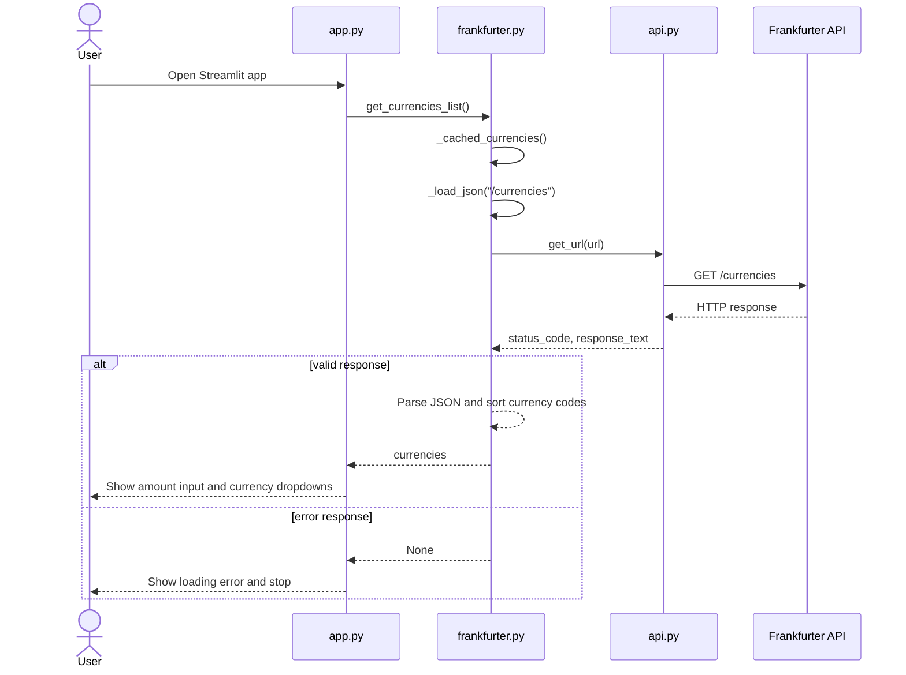
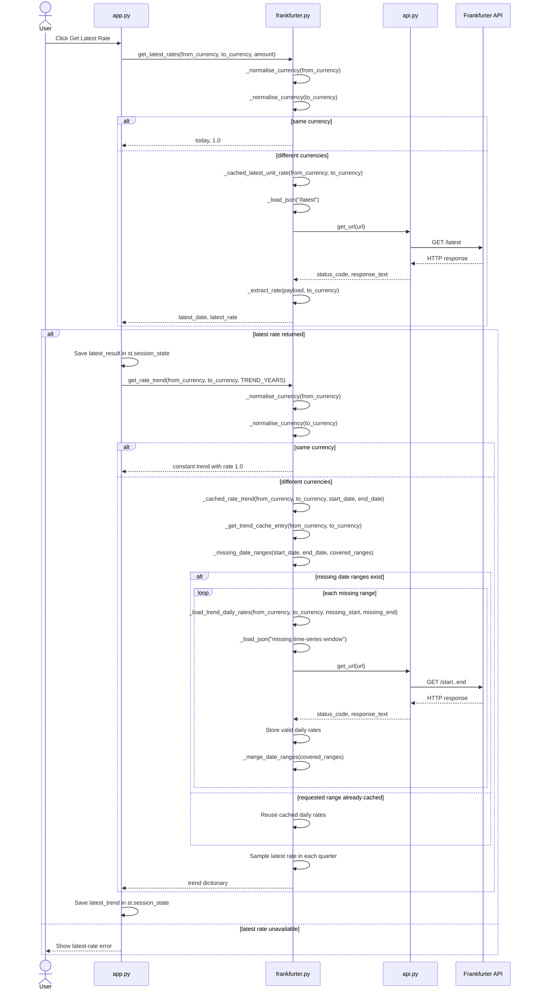
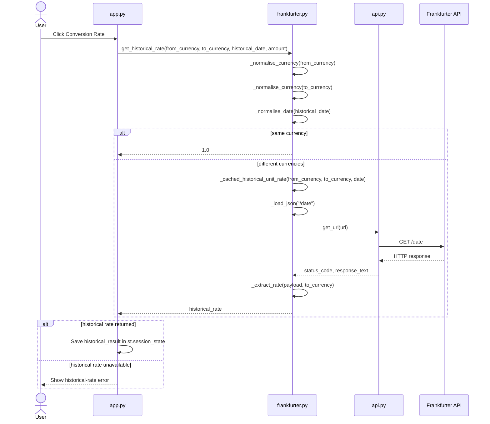
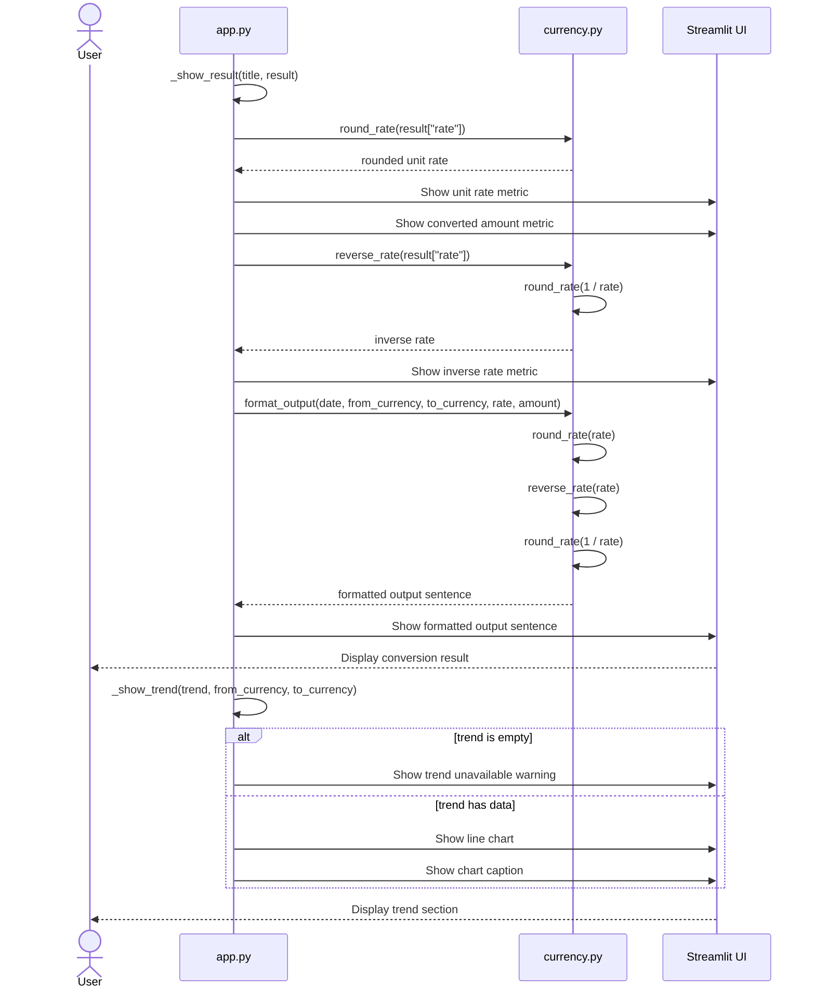

# FX Converter

## Author
Name: `Ratnadeep Patra`  
Student ID: `26294153`

GitHub Repository: https://github.com/RP28/DSP_AT2_26294153

## Description
FX Converter is a Streamlit web application that uses the Frankfurter API to list supported currencies, retrieve the latest exchange rate, retrieve a historical rate for a selected date, calculate the converted amount, and calculate the inverse rate. The starter's optional three-year rate-trend function is also implemented and shown after a successful latest-rate lookup.

The public latest and historical functions still accept `amount`, but the API layer caches the underlying **unit rate** independently of amount and performs `converted_amount = amount * rate` locally. This prevents changing only the amount from creating another downstream request for the same pair/date.

## How to Setup
The application was designed for **Python 3** with these direct dependencies:

- `streamlit==1.64.0`
- `requests==2.32.5`

Create and activate a virtual environment, then install the dependencies:

```bash
python3 -m venv .venv
source .venv/bin/activate          # macOS/Linux
.venv\Scripts\activate         # Windows
python3 -m pip install streamlit==1.64.0 requests==2.32.5
```

## How to Run the Program
From the folder containing the five submission files, run:

```bash
streamlit run app.py
```

Then select an amount and two currencies. Use **Get Latest Rate** for the latest conversion, or select a past date and use **Conversion Rate** for a historical conversion. The displayed sentence follows the format required by the assignment.

## Project Structure
- `app.py` - Streamlit UI, input validation, session-state result persistence, loading/error feedback, metrics, and the optional trend chart.
- `api.py` - low-level HTTP GET helper using a reusable `requests.Session` and a finite 10-second timeout.
- `frankfurter.py` - Frankfurter endpoint integration, response validation, same-currency handling, bounded caching, and trend sampling.
- `currency.py` - rate rounding, inverse-rate calculation, converted-amount calculation, and required output formatting.
- `README.md` - project documentation, setup, engineering decisions, and deployment configuration.

### Python functions

| File | Public functions | Private functions |
| --- | --- | --- |
| `api.py` | `get_url` | - |
| `currency.py` | `round_rate`, `reverse_rate`, `format_output` | - |
| `frankfurter.py` | `get_currencies_list`, `get_latest_rates`, `get_historical_rate`, `get_rate_trend` | `_load_json`, `_normalise_currency`, `_normalise_date`, `_extract_rate`, `_cached_currencies`, `_cached_latest_unit_rate`, `_cached_historical_unit_rate`, `_get_trend_cache_entry`, `_merge_date_ranges`, `_missing_date_ranges`, `_load_trend_daily_rates`, `_cached_rate_trend` |
| `app.py` | - | `_show_result`, `_show_trend` |

## Function Sequence Diagrams
### Currency loading


### Latest conversion and trend


### Historical conversion


### Rendering results and trend


## Design Decisions
HTTP calls use a reusable `requests.Session` with a finite timeout. Network failures, non-successful HTTP responses, malformed JSON, missing rate fields, invalid dates, and unavailable trend data are handled without exposing raw exceptions in the Streamlit UI. Same-currency conversions return a unit rate of `1.0` without making a redundant API request.

`st.session_state` stores successful latest/historical results so they remain visible after normal Streamlit reruns. The UI uses spinners and user-friendly `st.error`, `st.warning`, and `st.info` feedback.

## Performance and Caching
Caching uses Streamlit's in-memory `st.cache_data` with both `ttl` and `max_entries` for exact-match API requests. The trend chart uses a custom in-process interval cache because time-series responses can be large JSON payloads, and repeatedly downloading and parsing the same overlapping dates would be unnecessarily time consuming.

The custom trend cache stores daily rates by currency pair and tracks which date ranges are already covered. When a new trend request overlaps a cached range, the app calls Frankfurter only for the missing non-overlapping date ranges, then combines the cached and newly fetched data before sampling quarterly chart points.

| Data | Cache identity | TTL | `max_entries` | Reasoning |
| --- | --- | ---: | ---: | --- |
| Currency list | no arguments | 7 days | 1 | Very small and changes rarely. |
| Latest unit rate | currency pair | 1 hour | 128 | Rates update daily, while one-hour reuse avoids repeated rerun traffic. |
| Historical unit rate | currency pair + date | 30 days | 512 | Historical observations are effectively stable and each entry is tiny. |
| Trend daily window | currency pair + covered date ranges | 24 hours | 64 pairs | Avoids re-fetching overlapping parts of large historical JSON responses. |

The required public functions keep their starter `amount` parameter, but internal cached helpers deliberately exclude it. For example, AUD -> USD amounts of 10, 50, and 100 share the same cached unit rate. Failed API operations raise an internal exception before a cached function returns, so an error is not treated as valid rate data.

The trend implementation samples the latest available observation in each calendar quarter locally. A first request for a pair may still fetch the whole requested window, but later overlapping requests fetch only the missing leading or trailing period.

## Deployment
### Live Demo
`https://dsp-at2-26294153.onrender.com`

Current Render configuration for this project:

- **Service type:** Web Service
- **Runtime:** Python 3
- **Build Command:** `pip install streamlit==1.64.0 requests==2.32.5`
- **Start Command:** `streamlit run app.py --server.address 0.0.0.0 --server.port $PORT`
- **Environment variable:** `PYTHON_VERSION=3.13.5`
- **Other environment variables:** none required by the application

Keeping `PYTHON_VERSION` in Render's environment settings avoids adding an extra `.python-version` file to the assessed five-file submission structure.

## Citations
- Assignment API: Frankfurter - https://www.frankfurter.app/
- Frankfurter API documentation - https://frankfurter.dev/v1/
- Streamlit documentation - https://docs.streamlit.io/
- Requests documentation - https://requests.readthedocs.io/
- Render documentation - https://render.com/docs/
